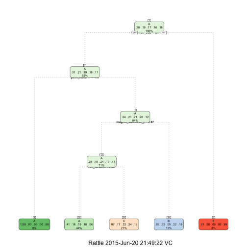

## Data

The training data for this project are available here: 

https://d396qusza40orc.cloudfront.net/predmachlearn/pml-training.csv

The test data are available here: 

https://d396qusza40orc.cloudfront.net/predmachlearn/pml-testing.csv

The data for this project come from this source: http://groupware.les.inf.puc-rio.br/har. 

## Synopisis

In what follows we try to predict the outcome variable (categorical variable called "classe") using 53 raw predictors, using popular machine learning algorithms.  

Initially, we considered 4 algorithms:

* 1. basic regression tree,
* 2. basic multinomial logistic regression with lasso penalty,
* 3. linear vector support machines,
* 4. random forest (a mixture of regression trees).

The algorithms 2 and 3 failed to compute on the data given, so we eliminated these two algorithms from consideration on purely computational grounds (the code for algorithm 2 is given below; the reader can try it, but it failed to give results over 2 hours on a Mac Book Pro).  This left us with not much to choose from: the basic regression trees and random forest. It was very easy for random forest to outform a basic regression tree, so we ended up picking the random forest.

When judging the performance of the two competing algorithms, we used the training and validation sample, resulting from 60 to 40 split of the original training data.  We also have an additional holdout sample of 20 observations, but that's too small to be useful as a real validation sample, so we only considered that last bit of data as a mere curiosity.  


## Load Packages

We first load the required packages.


```r
library(caret)
```

```
## Warning: package 'caret' was built under R version 3.1.3
```

```
## Loading required package: lattice
## Loading required package: ggplot2
```

```
## Warning: package 'ggplot2' was built under R version 3.1.3
```

```r
library(rpart)
library(rpart.plot)
```

```
## Warning: package 'rpart.plot' was built under R version 3.1.2
```

```r
library(RColorBrewer)
```

```
## Warning: package 'RColorBrewer' was built under R version 3.1.2
```

```r
library(rattle)
```

```
## Warning: package 'rattle' was built under R version 3.1.2
```

```
## Rattle: A free graphical interface for data mining with R.
## Version 3.4.1 Copyright (c) 2006-2014 Togaware Pty Ltd.
## Type 'rattle()' to shake, rattle, and roll your data.
```

```r
library(randomForest)
```

```
## Warning: package 'randomForest' was built under R version 3.1.2
```

```
## randomForest 4.6-10
## Type rfNews() to see new features/changes/bug fixes.
```

## Read Data 

We read in the data from the web.


```r
train.site <- "http://d396qusza40orc.cloudfront.net/predmachlearn/pml-training.csv"
test.site <- "http://d396qusza40orc.cloudfront.net/predmachlearn/pml-testing.csv"
train <- read.csv(url(train.site), na.strings=c("NA","#DIV/0!",""))
test <- read.csv(url(test.site), na.strings=c("NA","#DIV/0!",""))
```

## Look at data

We then look at the basic structure of the data.


```r
dim(train)
```

```
## [1] 19622   160
```

```r
dim(test)
```

```
## [1]  20 160
```

```r
#head(train)
str(train)
```

```
## 'data.frame':	19622 obs. of  160 variables:
##  $ X                       : int  1 2 3 4 5 6 7 8 9 10 ...
##  $ user_name               : Factor w/ 6 levels "adelmo","carlitos",..: 2 2 2 2 2 2 2 2 2 2 ...
##  $ raw_timestamp_part_1    : int  1323084231 1323084231 1323084231 1323084232 1323084232 1323084232 1323084232 1323084232 1323084232 1323084232 ...
##  $ raw_timestamp_part_2    : int  788290 808298 820366 120339 196328 304277 368296 440390 484323 484434 ...
##  $ cvtd_timestamp          : Factor w/ 20 levels "02/12/2011 13:32",..: 9 9 9 9 9 9 9 9 9 9 ...
##  $ new_window              : Factor w/ 2 levels "no","yes": 1 1 1 1 1 1 1 1 1 1 ...
##  $ num_window              : int  11 11 11 12 12 12 12 12 12 12 ...
##  $ roll_belt               : num  1.41 1.41 1.42 1.48 1.48 1.45 1.42 1.42 1.43 1.45 ...
##  $ pitch_belt              : num  8.07 8.07 8.07 8.05 8.07 8.06 8.09 8.13 8.16 8.17 ...
##  $ yaw_belt                : num  -94.4 -94.4 -94.4 -94.4 -94.4 -94.4 -94.4 -94.4 -94.4 -94.4 ...
##  $ total_accel_belt        : int  3 3 3 3 3 3 3 3 3 3 ...
##  $ kurtosis_roll_belt      : num  NA NA NA NA NA NA NA NA NA NA ...
##  $ kurtosis_picth_belt     : num  NA NA NA NA NA NA NA NA NA NA ...
##  $ kurtosis_yaw_belt       : logi  NA NA NA NA NA NA ...
##  $ skewness_roll_belt      : num  NA NA NA NA NA NA NA NA NA NA ...
##  $ skewness_roll_belt.1    : num  NA NA NA NA NA NA NA NA NA NA ...
##  $ skewness_yaw_belt       : logi  NA NA NA NA NA NA ...
##  $ max_roll_belt           : num  NA NA NA NA NA NA NA NA NA NA ...
##  $ max_picth_belt          : int  NA NA NA NA NA NA NA NA NA NA ...
##  $ max_yaw_belt            : num  NA NA NA NA NA NA NA NA NA NA ...
##  $ min_roll_belt           : num  NA NA NA NA NA NA NA NA NA NA ...
##  $ min_pitch_belt          : int  NA NA NA NA NA NA NA NA NA NA ...
##  $ min_yaw_belt            : num  NA NA NA NA NA NA NA NA NA NA ...
##  $ amplitude_roll_belt     : num  NA NA NA NA NA NA NA NA NA NA ...
##  $ amplitude_pitch_belt    : int  NA NA NA NA NA NA NA NA NA NA ...
##  $ amplitude_yaw_belt      : num  NA NA NA NA NA NA NA NA NA NA ...
##  $ var_total_accel_belt    : num  NA NA NA NA NA NA NA NA NA NA ...
##  $ avg_roll_belt           : num  NA NA NA NA NA NA NA NA NA NA ...
##  $ stddev_roll_belt        : num  NA NA NA NA NA NA NA NA NA NA ...
##  $ var_roll_belt           : num  NA NA NA NA NA NA NA NA NA NA ...
##  $ avg_pitch_belt          : num  NA NA NA NA NA NA NA NA NA NA ...
##  $ stddev_pitch_belt       : num  NA NA NA NA NA NA NA NA NA NA ...
##  $ var_pitch_belt          : num  NA NA NA NA NA NA NA NA NA NA ...
##  $ avg_yaw_belt            : num  NA NA NA NA NA NA NA NA NA NA ...
##  $ stddev_yaw_belt         : num  NA NA NA NA NA NA NA NA NA NA ...
##  $ var_yaw_belt            : num  NA NA NA NA NA NA NA NA NA NA ...
##  $ gyros_belt_x            : num  0 0.02 0 0.02 0.02 0.02 0.02 0.02 0.02 0.03 ...
##  $ gyros_belt_y            : num  0 0 0 0 0.02 0 0 0 0 0 ...
##  $ gyros_belt_z            : num  -0.02 -0.02 -0.02 -0.03 -0.02 -0.02 -0.02 -0.02 -0.02 0 ...
##  $ accel_belt_x            : int  -21 -22 -20 -22 -21 -21 -22 -22 -20 -21 ...
##  $ accel_belt_y            : int  4 4 5 3 2 4 3 4 2 4 ...
##  $ accel_belt_z            : int  22 22 23 21 24 21 21 21 24 22 ...
##  $ magnet_belt_x           : int  -3 -7 -2 -6 -6 0 -4 -2 1 -3 ...
##  $ magnet_belt_y           : int  599 608 600 604 600 603 599 603 602 609 ...
##  $ magnet_belt_z           : int  -313 -311 -305 -310 -302 -312 -311 -313 -312 -308 ...
##  $ roll_arm                : num  -128 -128 -128 -128 -128 -128 -128 -128 -128 -128 ...
##  $ pitch_arm               : num  22.5 22.5 22.5 22.1 22.1 22 21.9 21.8 21.7 21.6 ...
##  $ yaw_arm                 : num  -161 -161 -161 -161 -161 -161 -161 -161 -161 -161 ...
##  $ total_accel_arm         : int  34 34 34 34 34 34 34 34 34 34 ...
##  $ var_accel_arm           : num  NA NA NA NA NA NA NA NA NA NA ...
##  $ avg_roll_arm            : num  NA NA NA NA NA NA NA NA NA NA ...
##  $ stddev_roll_arm         : num  NA NA NA NA NA NA NA NA NA NA ...
##  $ var_roll_arm            : num  NA NA NA NA NA NA NA NA NA NA ...
##  $ avg_pitch_arm           : num  NA NA NA NA NA NA NA NA NA NA ...
##  $ stddev_pitch_arm        : num  NA NA NA NA NA NA NA NA NA NA ...
##  $ var_pitch_arm           : num  NA NA NA NA NA NA NA NA NA NA ...
##  $ avg_yaw_arm             : num  NA NA NA NA NA NA NA NA NA NA ...
##  $ stddev_yaw_arm          : num  NA NA NA NA NA NA NA NA NA NA ...
##  $ var_yaw_arm             : num  NA NA NA NA NA NA NA NA NA NA ...
##  $ gyros_arm_x             : num  0 0.02 0.02 0.02 0 0.02 0 0.02 0.02 0.02 ...
##  $ gyros_arm_y             : num  0 -0.02 -0.02 -0.03 -0.03 -0.03 -0.03 -0.02 -0.03 -0.03 ...
##  $ gyros_arm_z             : num  -0.02 -0.02 -0.02 0.02 0 0 0 0 -0.02 -0.02 ...
##  $ accel_arm_x             : int  -288 -290 -289 -289 -289 -289 -289 -289 -288 -288 ...
##  $ accel_arm_y             : int  109 110 110 111 111 111 111 111 109 110 ...
##  $ accel_arm_z             : int  -123 -125 -126 -123 -123 -122 -125 -124 -122 -124 ...
##  $ magnet_arm_x            : int  -368 -369 -368 -372 -374 -369 -373 -372 -369 -376 ...
##  $ magnet_arm_y            : int  337 337 344 344 337 342 336 338 341 334 ...
##  $ magnet_arm_z            : int  516 513 513 512 506 513 509 510 518 516 ...
##  $ kurtosis_roll_arm       : num  NA NA NA NA NA NA NA NA NA NA ...
##  $ kurtosis_picth_arm      : num  NA NA NA NA NA NA NA NA NA NA ...
##  $ kurtosis_yaw_arm        : num  NA NA NA NA NA NA NA NA NA NA ...
##  $ skewness_roll_arm       : num  NA NA NA NA NA NA NA NA NA NA ...
##  $ skewness_pitch_arm      : num  NA NA NA NA NA NA NA NA NA NA ...
##  $ skewness_yaw_arm        : num  NA NA NA NA NA NA NA NA NA NA ...
##  $ max_roll_arm            : num  NA NA NA NA NA NA NA NA NA NA ...
##  $ max_picth_arm           : num  NA NA NA NA NA NA NA NA NA NA ...
##  $ max_yaw_arm             : int  NA NA NA NA NA NA NA NA NA NA ...
##  $ min_roll_arm            : num  NA NA NA NA NA NA NA NA NA NA ...
##  $ min_pitch_arm           : num  NA NA NA NA NA NA NA NA NA NA ...
##  $ min_yaw_arm             : int  NA NA NA NA NA NA NA NA NA NA ...
##  $ amplitude_roll_arm      : num  NA NA NA NA NA NA NA NA NA NA ...
##  $ amplitude_pitch_arm     : num  NA NA NA NA NA NA NA NA NA NA ...
##  $ amplitude_yaw_arm       : int  NA NA NA NA NA NA NA NA NA NA ...
##  $ roll_dumbbell           : num  13.1 13.1 12.9 13.4 13.4 ...
##  $ pitch_dumbbell          : num  -70.5 -70.6 -70.3 -70.4 -70.4 ...
##  $ yaw_dumbbell            : num  -84.9 -84.7 -85.1 -84.9 -84.9 ...
##  $ kurtosis_roll_dumbbell  : num  NA NA NA NA NA NA NA NA NA NA ...
##  $ kurtosis_picth_dumbbell : num  NA NA NA NA NA NA NA NA NA NA ...
##  $ kurtosis_yaw_dumbbell   : logi  NA NA NA NA NA NA ...
##  $ skewness_roll_dumbbell  : num  NA NA NA NA NA NA NA NA NA NA ...
##  $ skewness_pitch_dumbbell : num  NA NA NA NA NA NA NA NA NA NA ...
##  $ skewness_yaw_dumbbell   : logi  NA NA NA NA NA NA ...
##  $ max_roll_dumbbell       : num  NA NA NA NA NA NA NA NA NA NA ...
##  $ max_picth_dumbbell      : num  NA NA NA NA NA NA NA NA NA NA ...
##  $ max_yaw_dumbbell        : num  NA NA NA NA NA NA NA NA NA NA ...
##  $ min_roll_dumbbell       : num  NA NA NA NA NA NA NA NA NA NA ...
##  $ min_pitch_dumbbell      : num  NA NA NA NA NA NA NA NA NA NA ...
##  $ min_yaw_dumbbell        : num  NA NA NA NA NA NA NA NA NA NA ...
##  $ amplitude_roll_dumbbell : num  NA NA NA NA NA NA NA NA NA NA ...
##   [list output truncated]
```

```r
#head(test)
str(test)
```

```
## 'data.frame':	20 obs. of  160 variables:
##  $ X                       : int  1 2 3 4 5 6 7 8 9 10 ...
##  $ user_name               : Factor w/ 6 levels "adelmo","carlitos",..: 6 5 5 1 4 5 5 5 2 3 ...
##  $ raw_timestamp_part_1    : int  1323095002 1322673067 1322673075 1322832789 1322489635 1322673149 1322673128 1322673076 1323084240 1322837822 ...
##  $ raw_timestamp_part_2    : int  868349 778725 342967 560311 814776 510661 766645 54671 916313 384285 ...
##  $ cvtd_timestamp          : Factor w/ 11 levels "02/12/2011 13:33",..: 5 10 10 1 6 11 11 10 3 2 ...
##  $ new_window              : Factor w/ 1 level "no": 1 1 1 1 1 1 1 1 1 1 ...
##  $ num_window              : int  74 431 439 194 235 504 485 440 323 664 ...
##  $ roll_belt               : num  123 1.02 0.87 125 1.35 -5.92 1.2 0.43 0.93 114 ...
##  $ pitch_belt              : num  27 4.87 1.82 -41.6 3.33 1.59 4.44 4.15 6.72 22.4 ...
##  $ yaw_belt                : num  -4.75 -88.9 -88.5 162 -88.6 -87.7 -87.3 -88.5 -93.7 -13.1 ...
##  $ total_accel_belt        : int  20 4 5 17 3 4 4 4 4 18 ...
##  $ kurtosis_roll_belt      : logi  NA NA NA NA NA NA ...
##  $ kurtosis_picth_belt     : logi  NA NA NA NA NA NA ...
##  $ kurtosis_yaw_belt       : logi  NA NA NA NA NA NA ...
##  $ skewness_roll_belt      : logi  NA NA NA NA NA NA ...
##  $ skewness_roll_belt.1    : logi  NA NA NA NA NA NA ...
##  $ skewness_yaw_belt       : logi  NA NA NA NA NA NA ...
##  $ max_roll_belt           : logi  NA NA NA NA NA NA ...
##  $ max_picth_belt          : logi  NA NA NA NA NA NA ...
##  $ max_yaw_belt            : logi  NA NA NA NA NA NA ...
##  $ min_roll_belt           : logi  NA NA NA NA NA NA ...
##  $ min_pitch_belt          : logi  NA NA NA NA NA NA ...
##  $ min_yaw_belt            : logi  NA NA NA NA NA NA ...
##  $ amplitude_roll_belt     : logi  NA NA NA NA NA NA ...
##  $ amplitude_pitch_belt    : logi  NA NA NA NA NA NA ...
##  $ amplitude_yaw_belt      : logi  NA NA NA NA NA NA ...
##  $ var_total_accel_belt    : logi  NA NA NA NA NA NA ...
##  $ avg_roll_belt           : logi  NA NA NA NA NA NA ...
##  $ stddev_roll_belt        : logi  NA NA NA NA NA NA ...
##  $ var_roll_belt           : logi  NA NA NA NA NA NA ...
##  $ avg_pitch_belt          : logi  NA NA NA NA NA NA ...
##  $ stddev_pitch_belt       : logi  NA NA NA NA NA NA ...
##  $ var_pitch_belt          : logi  NA NA NA NA NA NA ...
##  $ avg_yaw_belt            : logi  NA NA NA NA NA NA ...
##  $ stddev_yaw_belt         : logi  NA NA NA NA NA NA ...
##  $ var_yaw_belt            : logi  NA NA NA NA NA NA ...
##  $ gyros_belt_x            : num  -0.5 -0.06 0.05 0.11 0.03 0.1 -0.06 -0.18 0.1 0.14 ...
##  $ gyros_belt_y            : num  -0.02 -0.02 0.02 0.11 0.02 0.05 0 -0.02 0 0.11 ...
##  $ gyros_belt_z            : num  -0.46 -0.07 0.03 -0.16 0 -0.13 0 -0.03 -0.02 -0.16 ...
##  $ accel_belt_x            : int  -38 -13 1 46 -8 -11 -14 -10 -15 -25 ...
##  $ accel_belt_y            : int  69 11 -1 45 4 -16 2 -2 1 63 ...
##  $ accel_belt_z            : int  -179 39 49 -156 27 38 35 42 32 -158 ...
##  $ magnet_belt_x           : int  -13 43 29 169 33 31 50 39 -6 10 ...
##  $ magnet_belt_y           : int  581 636 631 608 566 638 622 635 600 601 ...
##  $ magnet_belt_z           : int  -382 -309 -312 -304 -418 -291 -315 -305 -302 -330 ...
##  $ roll_arm                : num  40.7 0 0 -109 76.1 0 0 0 -137 -82.4 ...
##  $ pitch_arm               : num  -27.8 0 0 55 2.76 0 0 0 11.2 -63.8 ...
##  $ yaw_arm                 : num  178 0 0 -142 102 0 0 0 -167 -75.3 ...
##  $ total_accel_arm         : int  10 38 44 25 29 14 15 22 34 32 ...
##  $ var_accel_arm           : logi  NA NA NA NA NA NA ...
##  $ avg_roll_arm            : logi  NA NA NA NA NA NA ...
##  $ stddev_roll_arm         : logi  NA NA NA NA NA NA ...
##  $ var_roll_arm            : logi  NA NA NA NA NA NA ...
##  $ avg_pitch_arm           : logi  NA NA NA NA NA NA ...
##  $ stddev_pitch_arm        : logi  NA NA NA NA NA NA ...
##  $ var_pitch_arm           : logi  NA NA NA NA NA NA ...
##  $ avg_yaw_arm             : logi  NA NA NA NA NA NA ...
##  $ stddev_yaw_arm          : logi  NA NA NA NA NA NA ...
##  $ var_yaw_arm             : logi  NA NA NA NA NA NA ...
##  $ gyros_arm_x             : num  -1.65 -1.17 2.1 0.22 -1.96 0.02 2.36 -3.71 0.03 0.26 ...
##  $ gyros_arm_y             : num  0.48 0.85 -1.36 -0.51 0.79 0.05 -1.01 1.85 -0.02 -0.5 ...
##  $ gyros_arm_z             : num  -0.18 -0.43 1.13 0.92 -0.54 -0.07 0.89 -0.69 -0.02 0.79 ...
##  $ accel_arm_x             : int  16 -290 -341 -238 -197 -26 99 -98 -287 -301 ...
##  $ accel_arm_y             : int  38 215 245 -57 200 130 79 175 111 -42 ...
##  $ accel_arm_z             : int  93 -90 -87 6 -30 -19 -67 -78 -122 -80 ...
##  $ magnet_arm_x            : int  -326 -325 -264 -173 -170 396 702 535 -367 -420 ...
##  $ magnet_arm_y            : int  385 447 474 257 275 176 15 215 335 294 ...
##  $ magnet_arm_z            : int  481 434 413 633 617 516 217 385 520 493 ...
##  $ kurtosis_roll_arm       : logi  NA NA NA NA NA NA ...
##  $ kurtosis_picth_arm      : logi  NA NA NA NA NA NA ...
##  $ kurtosis_yaw_arm        : logi  NA NA NA NA NA NA ...
##  $ skewness_roll_arm       : logi  NA NA NA NA NA NA ...
##  $ skewness_pitch_arm      : logi  NA NA NA NA NA NA ...
##  $ skewness_yaw_arm        : logi  NA NA NA NA NA NA ...
##  $ max_roll_arm            : logi  NA NA NA NA NA NA ...
##  $ max_picth_arm           : logi  NA NA NA NA NA NA ...
##  $ max_yaw_arm             : logi  NA NA NA NA NA NA ...
##  $ min_roll_arm            : logi  NA NA NA NA NA NA ...
##  $ min_pitch_arm           : logi  NA NA NA NA NA NA ...
##  $ min_yaw_arm             : logi  NA NA NA NA NA NA ...
##  $ amplitude_roll_arm      : logi  NA NA NA NA NA NA ...
##  $ amplitude_pitch_arm     : logi  NA NA NA NA NA NA ...
##  $ amplitude_yaw_arm       : logi  NA NA NA NA NA NA ...
##  $ roll_dumbbell           : num  -17.7 54.5 57.1 43.1 -101.4 ...
##  $ pitch_dumbbell          : num  25 -53.7 -51.4 -30 -53.4 ...
##  $ yaw_dumbbell            : num  126.2 -75.5 -75.2 -103.3 -14.2 ...
##  $ kurtosis_roll_dumbbell  : logi  NA NA NA NA NA NA ...
##  $ kurtosis_picth_dumbbell : logi  NA NA NA NA NA NA ...
##  $ kurtosis_yaw_dumbbell   : logi  NA NA NA NA NA NA ...
##  $ skewness_roll_dumbbell  : logi  NA NA NA NA NA NA ...
##  $ skewness_pitch_dumbbell : logi  NA NA NA NA NA NA ...
##  $ skewness_yaw_dumbbell   : logi  NA NA NA NA NA NA ...
##  $ max_roll_dumbbell       : logi  NA NA NA NA NA NA ...
##  $ max_picth_dumbbell      : logi  NA NA NA NA NA NA ...
##  $ max_yaw_dumbbell        : logi  NA NA NA NA NA NA ...
##  $ min_roll_dumbbell       : logi  NA NA NA NA NA NA ...
##  $ min_pitch_dumbbell      : logi  NA NA NA NA NA NA ...
##  $ min_yaw_dumbbell        : logi  NA NA NA NA NA NA ...
##  $ amplitude_roll_dumbbell : logi  NA NA NA NA NA NA ...
##   [list output truncated]
```
## Drop predictors that are  NAs

We remove predictors that are completely missing.


```r
train<-train[, colSums(is.na(train)) == 0]
dim(train)
```

```
## [1] 19622    60
```

```r
test <-test[,colSums(is.na(test)) == 0]
dim(test);
```

```
## [1] 20 60
```

```r
attach(train)
```

# Delete some variables  that are not highly relevant (time stamps etc.)

We now drop variables that don't seem relevant for external prediction, but
we have kept the "user name", since it could be relevant to prediction for the test data
we are given.


```r
train<- train[,-c(1, 3: 7)]
test <- test[,-c(1, 3: 7)]
```

# Look at how many NAs we have left:


```r
colSums(is.na(train))
```

```
##            user_name            roll_belt           pitch_belt 
##                    0                    0                    0 
##             yaw_belt     total_accel_belt         gyros_belt_x 
##                    0                    0                    0 
##         gyros_belt_y         gyros_belt_z         accel_belt_x 
##                    0                    0                    0 
##         accel_belt_y         accel_belt_z        magnet_belt_x 
##                    0                    0                    0 
##        magnet_belt_y        magnet_belt_z             roll_arm 
##                    0                    0                    0 
##            pitch_arm              yaw_arm      total_accel_arm 
##                    0                    0                    0 
##          gyros_arm_x          gyros_arm_y          gyros_arm_z 
##                    0                    0                    0 
##          accel_arm_x          accel_arm_y          accel_arm_z 
##                    0                    0                    0 
##         magnet_arm_x         magnet_arm_y         magnet_arm_z 
##                    0                    0                    0 
##        roll_dumbbell       pitch_dumbbell         yaw_dumbbell 
##                    0                    0                    0 
## total_accel_dumbbell     gyros_dumbbell_x     gyros_dumbbell_y 
##                    0                    0                    0 
##     gyros_dumbbell_z     accel_dumbbell_x     accel_dumbbell_y 
##                    0                    0                    0 
##     accel_dumbbell_z    magnet_dumbbell_x    magnet_dumbbell_y 
##                    0                    0                    0 
##    magnet_dumbbell_z         roll_forearm        pitch_forearm 
##                    0                    0                    0 
##          yaw_forearm  total_accel_forearm      gyros_forearm_x 
##                    0                    0                    0 
##      gyros_forearm_y      gyros_forearm_z      accel_forearm_x 
##                    0                    0                    0 
##      accel_forearm_y      accel_forearm_z     magnet_forearm_x 
##                    0                    0                    0 
##     magnet_forearm_y     magnet_forearm_z               classe 
##                    0                    0                    0
```

```r
colSums(is.na(test))
```

```
##            user_name            roll_belt           pitch_belt 
##                    0                    0                    0 
##             yaw_belt     total_accel_belt         gyros_belt_x 
##                    0                    0                    0 
##         gyros_belt_y         gyros_belt_z         accel_belt_x 
##                    0                    0                    0 
##         accel_belt_y         accel_belt_z        magnet_belt_x 
##                    0                    0                    0 
##        magnet_belt_y        magnet_belt_z             roll_arm 
##                    0                    0                    0 
##            pitch_arm              yaw_arm      total_accel_arm 
##                    0                    0                    0 
##          gyros_arm_x          gyros_arm_y          gyros_arm_z 
##                    0                    0                    0 
##          accel_arm_x          accel_arm_y          accel_arm_z 
##                    0                    0                    0 
##         magnet_arm_x         magnet_arm_y         magnet_arm_z 
##                    0                    0                    0 
##        roll_dumbbell       pitch_dumbbell         yaw_dumbbell 
##                    0                    0                    0 
## total_accel_dumbbell     gyros_dumbbell_x     gyros_dumbbell_y 
##                    0                    0                    0 
##     gyros_dumbbell_z     accel_dumbbell_x     accel_dumbbell_y 
##                    0                    0                    0 
##     accel_dumbbell_z    magnet_dumbbell_x    magnet_dumbbell_y 
##                    0                    0                    0 
##    magnet_dumbbell_z         roll_forearm        pitch_forearm 
##                    0                    0                    0 
##          yaw_forearm  total_accel_forearm      gyros_forearm_x 
##                    0                    0                    0 
##      gyros_forearm_y      gyros_forearm_z      accel_forearm_x 
##                    0                    0                    0 
##      accel_forearm_y      accel_forearm_z     magnet_forearm_x 
##                    0                    0                    0 
##     magnet_forearm_y     magnet_forearm_z           problem_id 
##                    0                    0                    0
```
It seems like the simple data-cleaning has produced a nice complete data-set.

# Split train into training and validation samples

Since the hold-out sample is ridiculously small, we split the training
sample into a training sample and a validation/testing sample, with the split
ratio 6:4.


```r
intrain<- createDataPartition(y=train$classe, p=0.6, list=FALSE)
training<-  train[intrain,]
testing<-  train[-intrain,]
dim(training)
```

```
## [1] 11776    54
```

```r
dim(testing)
```

```
## [1] 7846   54
```

# Try basic regression tree model for predicting to see what we get

Here we fit the basic regression tree model and plot the resulting tree.
We also look at the "confusion matrix", which summarizes the performance of the model in the testing data.  We see that the model predicts correctly 49% of the cases, with a 95% confidence set of  (0.4843, 0.5065), which is greater than roughly the random guess of 20% for the 5 cases of the "classe" outcome.


```r
regtreeFit <- train(classe ~.,data=training,preProcess=c("center","scale"),method="rpart",
metric="Accuracy")
print(regtreeFit$finalModel)
```

```
## n= 11776 
## 
## node), split, n, loss, yval, (yprob)
##       * denotes terminal node
## 
##  1) root 11776 8428 A (0.28 0.19 0.17 0.16 0.18)  
##    2) roll_belt< 1.050054 10781 7441 A (0.31 0.21 0.19 0.18 0.11)  
##      4) pitch_forearm< -1.605862 946    2 A (1 0.0021 0 0 0) *
##      5) pitch_forearm>=-1.605862 9835 7439 A (0.24 0.23 0.21 0.2 0.12)  
##       10) magnet_dumbbell_y< 0.6667998 8310 5964 A (0.28 0.18 0.24 0.19 0.11)  
##         20) roll_forearm< 0.825199 5167 3056 A (0.41 0.18 0.19 0.16 0.058) *
##         21) roll_forearm>=0.825199 3143 2122 C (0.075 0.17 0.32 0.24 0.19) *
##       11) magnet_dumbbell_y>=0.6667998 1525  739 B (0.033 0.52 0.045 0.22 0.19) *
##    3) roll_belt>=1.050054 995    8 E (0.008 0 0 0 0.99) *
```

```r
fancyRpartPlot(regtreeFit$finalModel,cex=.5,under.cex=1,shadow.offset=0)
```

 


```r
regtreepredict=predict(regtreeFit,testing)
confusionMatrix(testing$classe,regtreepredict)
```

```
## Confusion Matrix and Statistics
## 
##           Reference
## Prediction    A    B    C    D    E
##          A 2018   37  171    0    6
##          B  627  508  383    0    0
##          C  622   40  706    0    0
##          D  598  241  447    0    0
##          E  221  201  376    0  644
## 
## Overall Statistics
##                                           
##                Accuracy : 0.494           
##                  95% CI : (0.4829, 0.5051)
##     No Information Rate : 0.5208          
##     P-Value [Acc > NIR] : 1               
##                                           
##                   Kappa : 0.3386          
##  Mcnemar's Test P-Value : NA              
## 
## Statistics by Class:
## 
##                      Class: A Class: B Class: C Class: D Class: E
## Sensitivity            0.4939  0.49464  0.33893       NA  0.99077
## Specificity            0.9431  0.85188  0.88513   0.8361  0.88911
## Pos Pred Value         0.9041  0.33465  0.51608       NA  0.44660
## Neg Pred Value         0.6316  0.91798  0.78743       NA  0.99906
## Prevalence             0.5208  0.13089  0.26549   0.0000  0.08284
## Detection Rate         0.2572  0.06475  0.08998   0.0000  0.08208
## Detection Prevalence   0.2845  0.19347  0.17436   0.1639  0.18379
## Balanced Accuracy      0.7185  0.67326  0.61203       NA  0.93994
```


# Next we try the multinomial logistic model with Lasso penalization


```r
#logitModel <- train(as.factor(classe)~.,data=training, method='glmnet',tuneGrid=expand###.grid(.alpha=1, .lambda=20), family
#="multinomial")
#plot(model)
#coef(model$finalModel, s=model$bestTune$.lambda)
```

This failed to compute in a reasonable amount of time, so we abandoned it, having to force-kill the rprocess.  Too bad for glmnet package. We wish it were more efficient computationally.


# We next try random forest, which is a mixture of regression trees.

The random forest is a mixture of regression tree, each fitted over a different bootstrap sample, which allows it to combine basic tree


```r
set.seed(1)
forestFit <- train(classe ~ ., method="rf",trControl=trainControl(method = "cv", number =5), data=training)
```


```r
print(forestFit)
```

```
## Random Forest 
## 
## 11776 samples
##    53 predictor
##     5 classes: 'A', 'B', 'C', 'D', 'E' 
## 
## No pre-processing
## Resampling: Cross-Validated (5 fold) 
## 
## Summary of sample sizes: 9421, 9420, 9423, 9420, 9420 
## 
## Resampling results across tuning parameters:
## 
##   mtry  Accuracy   Kappa      Accuracy SD  Kappa SD   
##    2    0.9863279  0.9827017  0.004487297  0.005680648
##   29    0.9892150  0.9863556  0.002415356  0.003057291
##   57    0.9833570  0.9789432  0.003796549  0.004806476
## 
## Accuracy was used to select the optimal model using  the largest value.
## The final value used for the model was mtry = 29.
```

```r
forestpredict=predict(forestFit,testing)
confusionMatrix(testing$classe,forestpredict)
```

```
## Confusion Matrix and Statistics
## 
##           Reference
## Prediction    A    B    C    D    E
##          A 2225    6    0    0    1
##          B    6 1507    5    0    0
##          C    0    3 1359    5    1
##          D    0    1   23 1261    1
##          E    0    1    1    7 1433
## 
## Overall Statistics
##                                        
##                Accuracy : 0.9922       
##                  95% CI : (0.99, 0.994)
##     No Information Rate : 0.2843       
##     P-Value [Acc > NIR] : < 2.2e-16    
##                                        
##                   Kappa : 0.9902       
##  Mcnemar's Test P-Value : NA           
## 
## Statistics by Class:
## 
##                      Class: A Class: B Class: C Class: D Class: E
## Sensitivity            0.9973   0.9928   0.9791   0.9906   0.9979
## Specificity            0.9988   0.9983   0.9986   0.9962   0.9986
## Pos Pred Value         0.9969   0.9928   0.9934   0.9806   0.9938
## Neg Pred Value         0.9989   0.9983   0.9955   0.9982   0.9995
## Prevalence             0.2843   0.1935   0.1769   0.1622   0.1830
## Detection Rate         0.2836   0.1921   0.1732   0.1607   0.1826
## Detection Prevalence   0.2845   0.1935   0.1744   0.1639   0.1838
## Balanced Accuracy      0.9980   0.9955   0.9889   0.9934   0.9983
```

We see that the random forest produces 99% of the out-of-sample prediction accuracy, with a 95% confidence interval of (0.9887, 0.993), which is extremely impressive performance.  It dominates the simple regression tree model along many other measures, such as specificity and sensitivity.    Thus, we have little choice but to pick the random forest as the winning algorithm.


## Predicting the test cases

Now we go the 20 test cases provided to use and build predictions for those.


```r
forestpredict.final<-predict(forestFit,test)
print(forestpredict.final)
```

```
##  [1] B A B A A E D B A A B C B A E E A B B B
## Levels: A B C D E
```

Write out the answers for the automatic grading

```r
pml_write_files = function(x){
  n = length(x)
  for(i in 1:n){
    filename = paste0("problem_id_",i,".txt")
    write.table(x[i],file=filename,quote=FALSE,row.names=FALSE,col.names=FALSE)
  }
}

pml_write_files(forestpredict.final)
```

## Conclusion


We tried to predict the outcome variable (categorical variable called "classe") using 53 raw predictors, using popular machine learning algorithms.  

We considered 4 algorithms:

* 1. basic regression tree,
* 2. basic multinomial logistic regression with lasso penalty,
* 3. linear vector support machines,
* 4. random forest (a mixture of regression trees).

We eliminated  algorithms 2 and 3 on computational grounds. We have chosen algorithm 4 based upon the far superior out-of-sample prediction performance, namely used a hold-out validation sample to test the final choice between the two algorithms.  


